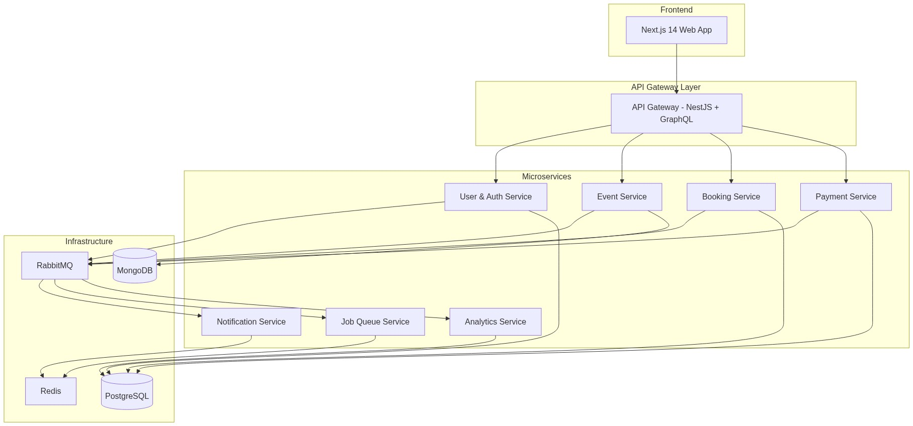

# 🎫 EventFlow Nexus - Event Management Microservices Platform



> **A scalable, enterprise-grade Real-time Event Management & Ticketing Platform built with NestJS, Next.js, and Event-Driven Microservices Architecture.**

---

## 🚀 Project Overview

**EventFlow Nexus** is a comprehensive distributed system designed to handle high-concurrency event booking, real-time notifications, and complex payments. It serves as a reference implementation for advanced **NestJS** patterns and **Microservices** architecture.

Unlike simple monolithic applications, EventFlow Nexus mimics real-world enterprise constraints, featuring:

- **Event-Driven Architecture** using RabbitMQ for asynchronous communication.
- **CQRS** (Command Query Responsibility Segregation) for high-performance booking processing.
- **Saga Pattern** for distributed transactions and data consistency.
- **API Gateway** pattern with GraphQL Federation.
- **Hybrid Database** approach (PostgreSQL for relational data, MongoDB for flexible event schemas, Redis for caching).

---

## 🛠️ Technology Stack

| Category      | Technologies                                     |
| ------------- | ------------------------------------------------ |
| **Frontend**  | Next.js 14, TailwindCSS, TypeScript              |
| **Backend**   | NestJS, Express, GraphQL (Federation)            |
| **Databases** | PostgreSQL (TypeORM), MongoDB (Mongoose), Redis  |
| **Messaging** | RabbitMQ (AmqpLib)                               |
| **DevOps**    | Docker, Docker Compose, Turborepo (Monorepo)     |
| **Concepts**  | CQRS, Event Sourcing, Sagas, WebSocket, JWT Auth |

---

## 🏗️ System Architecture

The system is broken down into autonomous services, each responsible for a specific domain:

| Service                | Purpose                                    | Key Tech                   |
| ---------------------- | ------------------------------------------ | -------------------------- |
| **🔒 API Gateway**     | Single entry point, routing, rate limiting | NestJS, GraphQL Federation |
| **👤 User Service**    | Authentication, User Profiles, RBAC        | PostgreSQL, JWT            |
| **📅 Event Service**   | Event creation, management, searching      | MongoDB, Mongoose          |
| **🎫 Booking Service** | Ticket inventory, booking logic (CQRS)     | PostgreSQL, Event Store    |
| **💸 Payment Service** | Payment processing (Stripe/PayPal)         | PostgreSQL, Outbox Pattern |
| **🔔 Notification**    | Real-time alerts (Email/Push/Socket)       | Redis PubSub, WebSockets   |
| **📊 Analytics**       | Dashboards, Reporting, Aggregations        | PostgreSQL, Cron Jobs      |
| **⚡ Job Service**     | Background workers, cleanup tasks          | BullMQ                     |

### Microservices Communication

- **Synchronous**: GraphQL / REST (Client to Gateway)
- **Asynchronous**: RabbitMQ (Service to Service) for decoupling and scalability.

---

## 🚀 Getting Started

Follow these instructions to set up the project locally.

### Prerequisites

- Node.js (v18+)
- Docker & Docker Compose
- npm or pnpm

### 1. Clone the Repository

```bash
git clone https://github.com/ShivanshAgarwalOfficial/eventflow-nexus-microservices.git
cd eventflow-nexus-microservices
```

### 2. Install Dependencies

We use **Turborepo** to manage the monorepo.

```bash
npm install
```

### 3. Start Infrastructure

Spin up the required databases and message brokers (Postgres, Mongo, RabbitMQ, Redis) using Docker.

```bash
npm run docker:up
```

_Wait for a minute until all containers are healthy._

### 4. Run the Development Server

Start all microservices in development mode.

```bash
npm run dev
```

### 5. Access RabbitMQ Management UI

- **URL**: `http://localhost:15672`
- **Username**: `eventflow`
- **Password**: `eventflow123`

---

## 📦 Project Structure

```bash
├── apps/
│   ├── web/                 # Next.js Frontend
│   ├── api-gateway/         # Main Entry Point
│   ├── user-service/        # Auth & Users
│   ├── event-service/       # Event Management
│   ├── booking-service/     # Booking Logic (CQRS)
│   ├── payment-service/     # Payments
│   └── ...
├── packages/
│   ├── shared-types/        # Shared TypeScript Interfaces
│   ├── message-contracts/   # RabbitMQ Event Definitions
│   └── shared-utils/        # Common Guards, Decorators, etc.
├── infrastructure/          # Docker & Deployment Configs
├── docker-compose.yml       # Local Dev Infrastructure
└── turbo.json               # Monorepo Pipeline Config
```

---

## 🎯 Milestones

- [x] **Phase 1**: Foundation Setup (Monorepo, Docker, Shared Packages)
- [ ] **Phase 2**: User & Auth Service (JWT, Guards)
- [ ] **Phase 3**: Event Service (MongoDB, CRUD)
- [ ] **Phase 4**: Booking Service (CQRS, Event Sourcing)
- [ ] **Phase 5**: Payment & Notification Services
- [ ] **Phase 6**: Job Queue & Analytics
- [ ] **Phase 7**: Next.js Frontend Implementation
- [ ] **Phase 8**: Deployment & CI/CD

---

## 🤝 Contributing

Contributions are welcome! Please open an issue or submit a pull request.

## 📄 License

This project is licensed under the MIT License.

## 👨‍💻 Author

**Shivansh Agarwal**

- Built as a comprehensive learning journey into NestJS microservices.
